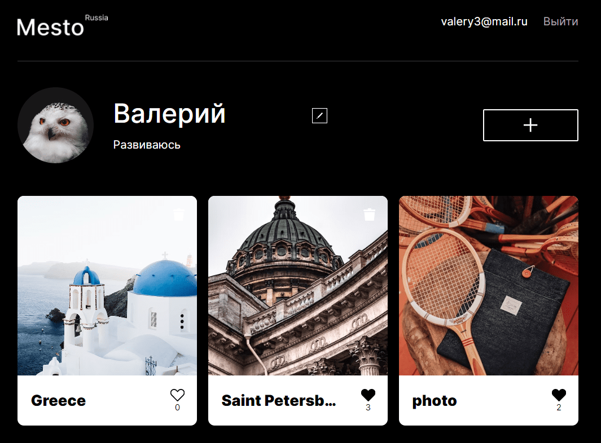

<h1 style="font-size:30px;text-align:center;background-color:#3fc1c9;margin:0;padding:0;line-height:1.5;display:block;border-radius:16px;box-shadow: 0 0 4px 2px rgba(0,0,0,0.25)">Проект "Место"</h1>

_Скриншот главной страницы_

<h2 style="font-size:22px;color:#364f6b;text-align:center;">Описание проекта</h2>

Учебный проект, в котором реализована возможность регистрации пользователя. Реализована возможность пользователям добавлять фотографии мест с названием, в которых были или которые планирует посетить. Эти места можно оценить, нажав кнопку лайка и наоборот. Так можно посмотреть скольким людям еще хочется попасть туда. Места также можно удалять. При необходимости можно отредактировать свой профиль, включая аватарку.

<h2 style="font-size:22px;color:#364f6b;text-align:center;">Используемые технологии</h2>

<h3 style="font-size:18px;color:#364f6b;margin-bottom:25px">Frontend stack</h3>

<h3 style="font-size:18px;color:#364f6b;margin-bottom:25px">Backend stack</h3>

:heavy_check_mark: Валидация данных - __*Celebrate, Validator*__
:heavy_check_mark: Шифрование пароля - __*Bcrypt*__
:heavy_check_mark: Передача токена пользователю - __*Cookie, Cookie-parser*__

<h3 style="font-size:18px;color:#364f6b;margin-bottom:25px">Other</h3>

<h2 style="font-size:22px;color:#364f6b;text-align:center;">Функциональность проекта</h2>

- Адаптивная кроссбраузерная вёрстка с использование Flex box, Grid Layout, стили написаны по методологии БЭМ, отзывчивый интерфейс, соблюдена семантика HTML.
- Основная страница `/` - размещены все места, данные профиля, аватар. На мобильных устройствах - бургер-меню с выпадающим email пользователя и кнопкой выйти. Страница регистрации `/sign-up` - если уже зарегистрирован можно перейти по ссылке на страницу логина. Страница логина `/sign-in`.
- Основная страница защищена HOC компонентом `ProtectedRoute.js` - которая не даёт не зарегистрированным пользователям перейти на неё, вместо этого - навигация на страницу регистрации.
- Аутентификация после закрытии вкладки или браузера с помощью токена, передаваемого с помощью файлов cookie.
- Всплывающие модальные окна для уведомления пользователя о статусе процесса - (success/fail)
- Валидация данных при регистрации и авторизации на стороне клиента с помощью кастомного хука `formValidator.js`.
- Асинхронные запросы к серверу по архитектуре REST API с помощью `fetch`:
  - **Контент**
  - GET `${this._baseUrl}/users/me`
  - GET `${this._baseUrl}/cards`
  - POST `${this._baseUrl}/cards`
  - PUT `${this._baseUrl}/cards/${id}/likes`
  - PATCH `${this._baseUrl}/users/me`
  - PATCH `${this._baseUrl}/users/me/avatar`
  - DELETE `${this._baseUrl}/cards/${id}`
  - DELETE `${this._baseUrl}/cards/${id}/likes`
  - **Авторизация**
  - POST `${BASE_URL}/signup`
  - POST `${BASE_URL}/signin`
  - GET `${BASE_URL}/signout`

<h2 style="font-size:22px;color:#364f6b;text-align:center;">Ссылки</h2>

:arrow_right: **Frontend** часть размещена на виртуальной машине \_Yandex Cloud*, доступна по **[ссылке](https://mesto.koshinva.nomoredomains.club/ 'https://mesto.koshinva.nomoredomains.club/')**

:arrow_right: **Backend** часть также размещена на виртуальной машине \_Yandex Cloud*, доступна по **[ссылке](https://api.mesto.koshinva.nomoredomains.club/ 'https://api.mesto.koshinva.nomoredomains.club/')**

:arrow_right: **Репозиторий проекта на GitHub** доступен по **[ссылке](https://github.com/koshinva/react-mesto-api-full 'https://github.com/koshinva/react-mesto-api-full')**

:arrow_down: **Задать вопрос по проекту**  

